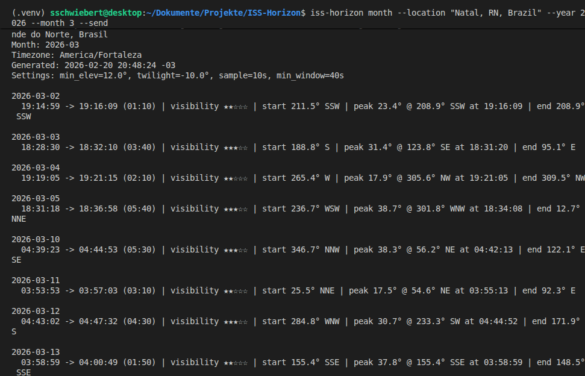
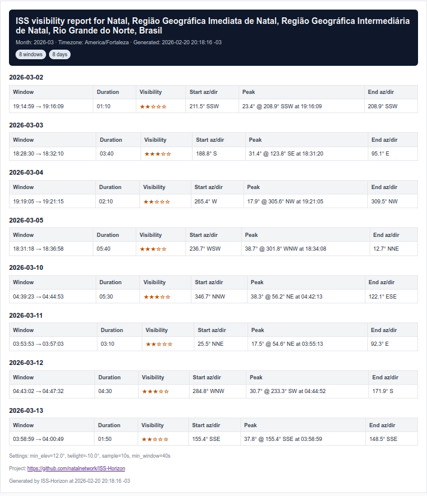

# ISS-Horizon

[](https://github.com/natalnetwork/ISS-Horizon/actions/workflows/ci.yml?query=branch%3Amain)
[](https://www.python.org/)
[](LICENSE)
[](https://github.com/natalnetwork/ISS-Horizon/releases)

ISS-Horizon predicts **ISS pass windows** for your location and generates a monthly plain-text report.
It can email the monthly report via SMTP and run unattended with a systemd timer in Debian-based LXC.

> [!WARNING]
> Never commit `.env` files or SMTP credentials. For unattended deployments, store secrets in
> `/etc/iss-horizon/iss-horizon.env` and reference that file from systemd.

## Features

- Resolve locations (query -> coordinates + IANA timezone)
- Predict ISS pass windows with configurable thresholds:
  - minimum ISS elevation
  - observer darkness (sun altitude twilight cutoff)
  - ISS sunlit condition
  - minimum segment duration
- Plain-text monthly report grouped by day
- Optional SMTP delivery (HTML email + plain-text fallback)
- CLI-first workflow + systemd timer support

## Installation

For a global CLI install (recommended for daily use):

```bash
pipx install iss-horizon
```

For local development:

```bash
python3 -m venv .venv
source .venv/bin/activate
pip install --upgrade pip
pip install -e .[dev]
```

## CLI Usage

### Next ISS windows (48h)

```bash
iss-horizon next --location "Natal, RN, Brazil" --hours 48
```

### Next ISS windows as JSON

```bash
iss-horizon next --location "Natal, RN, Brazil" --hours 48 --json
```

### Monthly report

```bash
iss-horizon month --location "Natal, RN, Brazil" --year 2026 --month 3
```

### Monthly report as HTML file (for browser)

```bash
iss-horizon month --location "Natal, RN, Brazil" --year 2026 --month 3 --html-out report.html
xdg-open report.html
```

### Monthly report + email

```bash
iss-horizon month --location "Natal, RN, Brazil" --year 2026 --month 3 --send --email-to you@example.com
```

### Show effective configuration

```bash
iss-horizon config
```

### Interactive setup wizard

```bash
iss-horizon setup --env-file .env
```

Optional SMTP check while saving configuration:

```bash
iss-horizon setup --env-file .env --test-email
```

## Configuration

Preferred setup path:

```bash
iss-horizon setup --env-file .env
```

This writes a local `.env` file with your location, thresholds, and SMTP settings.

Manual alternative:

```bash
cp .env.example .env
chmod 600 .env
```

Then edit `.env` directly (or set env vars in your shell/systemd env file).

Important variables:

- `ISS_LOCATION`, `REPORT_TO`
- `ISS_TLE_URL`, `ISS_TLE_NAME`
- `NOMINATIM_USER_AGENT`
- `ISS_MIN_ELEV_DEG`, `ISS_TWILIGHT_DEG`, `ISS_SAMPLE_SECONDS`, `ISS_MIN_WINDOW_SECONDS`
- `ISS_PROJECT_URL` (optional, shown in report/email footer)
- `SMTP_HOST`, `SMTP_PORT`, `SMTP_USER`, `SMTP_PASSWORD`, `SMTP_FROM`, `SMTP_TLS_MODE`

## Run monthly bot module

```bash
python -m iss_horizon.run_monthly
```

Requires `ISS_LOCATION`, `REPORT_TO` and SMTP env vars.

## Debian 12 LXC (systemd)

Provided files:

- `systemd/iss-horizon.service`
- `systemd/iss-horizon.timer`
- `scripts/install_lxc_debian12.sh`

Quick setup (inside the LXC container):

```bash
sudo bash scripts/install_lxc_debian12.sh <your-repo-url>
```

Before relying on delivery, edit `/etc/iss-horizon/iss-horizon.env` and set real SMTP credentials + recipient.

## Releases

- Create signed tags and publish GitHub Releases for each version.
- Include a short changelog in the release body (see `RELEASE_v0.1.1.md` as a source).
- Use `docs/release-checklist.md` and `.github/RELEASE_TEMPLATE.md` for a fast, consistent process.
- Releases page: <https://github.com/natalnetwork/ISS-Horizon/releases>

## Screenshots

CLI (terminal output):



HTML report preview:



## Quality Tooling

- `ruff` for linting and formatting
- `mypy` for static typing
- `pytest` for tests
- GitHub Actions CI for Python 3.11 + 3.12
- `pre-commit` hooks configuration

## Contribution note

- Keep all documentation, docstrings, code comments, and user-facing help text in English.
- Prefer concise, technical wording suitable for portfolio-grade project documentation.

## Naming conventions

- Product and CLI branding use ISS-Horizon and the command iss-horizon.
- Python package namespace is iss_horizon (underscore for import compatibility).
- Domain terms like visibility, VisibilityWindow, and visibility_stars are intentionally kept,
  because they describe the prediction model rather than project branding.

## Limitations

- Predictions depend on TLE freshness.
- Local obstructions and weather are not modeled.
- Light pollution can reduce practical visibility.

## Data sources

- CelesTrak (TLE data)
- OpenStreetMap Nominatim (geocoding)
- Skyfield (orbital mechanics, alt/az, sunlit state)

## Support

If ISS-Horizon is useful to you, consider supporting the project:

- GitHub Sponsors (recommended for this repository)

## License

MIT. See [LICENSE](LICENSE).
